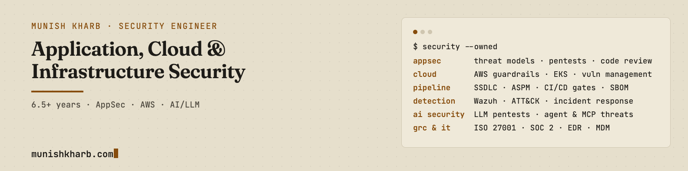

- **Security engineer, 6.5+ years** across healthtech, e-commerce and gaming: application, cloud and infrastructure security owned end to end, from threat model to pipeline to detection.
- **What I do:** threat modeling and secure design review, penetration testing (web, mobile, API, desktop), secure code review in Java, Python and JavaScript, DevSecOps and ASPM programs, AWS guardrails, detection engineering on Wazuh.
- **Current focus:** AWS and Kubernetes security, AI and LLM application security, agent and MCP threat modeling.

### Reach me

